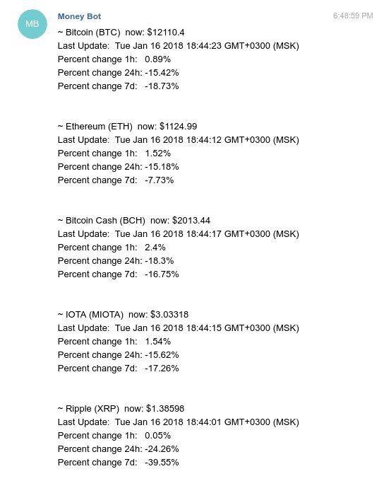

# telegramMoneyBot

This bot create for get real-time price cryptocurrency from https://coinmarketcap.com/

You can send command:
- <strong>all</strong> - for get all special coins from my side (BTC, ETH, BCH, IOTA, XRP, XLM)
- First letter name coins (example: <strong>r</strong>) - for get one coins

Result view:
You got information with price, percent change

Coming soon:
- Get any coins by short name (example: BTC)
- Call message when there is a strong decline/growth

